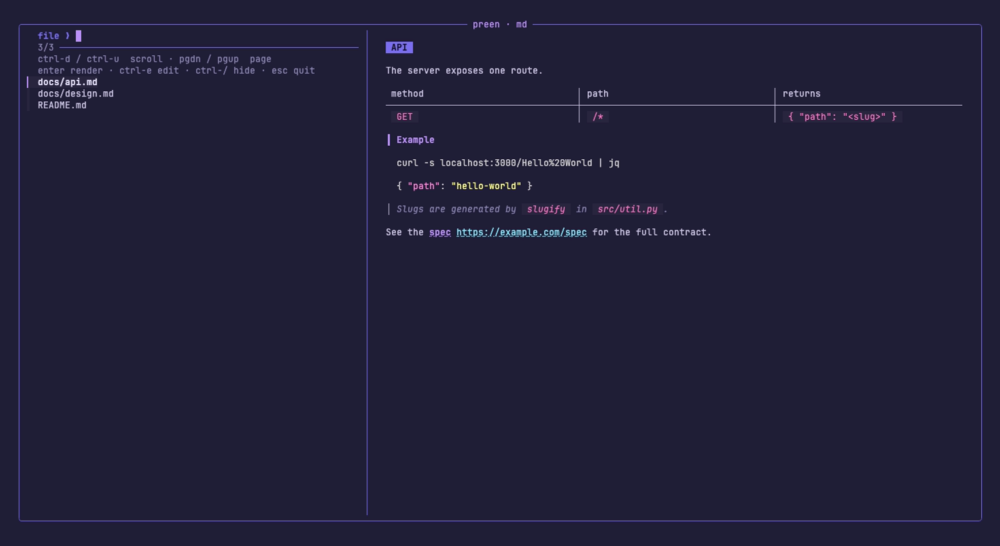

# preen

Markdown and diffs in the terminal, without opening an editor.

Birds preen to tidy their feathers. You preen your diff before you commit.


Markdown mode, same keys:



Thin glue over three tools that already do the hard part:

| job | tool |
|---|---|
| render markdown | `glow` (3.0 or newer) |
| render diffs | `delta` |
| file navigation | `fzf` |

## Install

```sh
curl -fsSL https://raw.githubusercontent.com/beatzball/preen/main/install.sh | bash
```

That clones preen to `~/.local/share/preen` and links `preen` into
`~/.local/bin`. While the repo is **private** that URL returns 404; clone it
with an authenticated client first:

```sh
gh repo clone beatzball/preen && ./preen/install.sh
```

The installer is safe to run again. It:

0. clones the repo if it is not already running from a checkout,
1. installs `glow`, `delta` and `fzf` if they are missing,
2. copies `themes/glow-roost.json` to `~/.config/glow/roost.json`,
3. writes the delta theme into `~/.gitconfig` (backed up first, once),
4. registers the `git preen` alias and the `preen` difftool,
5. links `bin/preen` into `~/.local/bin`,
6. tells you if that directory is not on your PATH.

### Options

| flag | effect |
|---|---|
| `--dry-run` | print every step, change nothing |
| `--no-deps` | config only, install no packages |
| `--user` | always fetch tools into `~/.local/bin`, never use sudo |
| `--dir DIR` | clone preen somewhere else (default `~/.local/share/preen`) |
| `--prefix DIR` | link `preen` somewhere else |
| `--uninstall` | undo the theme, the git alias, the difftool, the link and the config |

### Platforms

macOS and Linux. It uses whichever of `brew`, `apt-get`, `dnf`, `pacman`,
`zypper` or `apk` it finds. If the package manager has no package for a tool,
it falls back to that tool's official GitHub release tarball and drops the
binary in `~/.local/bin`. No sudo is needed for the fallback path.

`--uninstall` removes every `delta.*` theme key plus `alias.preen`, `diff.tool`,
`difftool.preen.cmd` and `difftool.prompt`. It keeps `core.pager`,
`interactive.diffFilter`, `delta.navigate` and `delta.dark`, because those are a
plain delta setup rather than this theme. It never removes packages.

## Use

```sh
preen                 # auto: diffs in a git repo, else markdown
preen md [DIR]        # browse markdown files under DIR (default .)
preen diff [REV]      # browse files changed vs REV (default: working tree)
preen FILE.md         # render one file and quit
preen --help
```

### Pipes

With something on stdin and no file argument, `preen` renders it and quits. No
picker, no fzf. A single `-` asks for the same thing out loud.

```sh
git diff | preen           # delta renders it
gh pr diff 42 | preen      # so does a PR diff
cat NOTES.md | preen       # glow renders it
preen - < NOTES.md         # the same, said out loud
git diff | preen > out.txt # colour is kept in the file too
```

It picks the renderer by sniffing the content: `diff --git`, `--- ` / `+++ ` or
`@@ ` headers mean `delta`, anything else means `glow`. The sniff strips ANSI
escapes first, so `git diff --color=always | preen` is still read as a diff.

On a terminal the output is paged through `less -R`. Into a pipe or a file it
is written plain, colour and all. `PREEN_LAYOUT=inline` applies here too.

### Git integration

`install.sh` adds two entry points to your global git config:

```sh
git preen                  # same as: preen diff
git difftool -t preen      # render one file's diff at a time
git difftool               # the same; preen is the default diff.tool
```

`git preen` is a `!` alias, so it runs `preen diff` from the repo root. The
difftool builds a plain unified diff and pipes it into `preen -`, which sends it
to delta and pages it. `difftool.prompt` is set to `false` so git does not ask
before each file.

### Keys

| key | action |
|---|---|
| `ctrl-s` | toggle side-by-side / inline (diff mode) |
| `enter` | open the full render in a pager |
| `ctrl-e` | open in `$EDITOR` |
| `ctrl-d` / `ctrl-u` | scroll the preview 8 lines |
| `pgdn` / `pgup` | scroll the preview half a page |
| `shift-down` / `shift-up` | scroll the preview one line |
| `home` / `end` | jump the preview to the top or bottom |
| `ctrl-/` | hide or show the preview |
| `esc` | quit |

## Theming

Both renderers use the roost palette (`#7c6ff0` purple, `#c8c3e0` text, `#8a84b0` dim).

- **glow**: `~/.config/glow/roost.json`. Override with `PREEN_GLOW_STYLE=/path/to/style.json`.
- **delta**: the `[delta]` section of `~/.gitconfig`, syntax theme `Dracula`.
- Start in inline layout with `PREEN_LAYOUT=inline preen diff`. This is the only
  way to do it today. A per-repo `git config preen.layout inline` is a planned
  follow-up and is **not implemented yet**, so setting that key does nothing.

The diff layout lives in two named delta features so `preen` can flip between them:

```ini
[delta]
    features = sbs
[delta "sbs"]
    side-by-side = true
[delta "inline"]
    side-by-side = false
```

Keep `side-by-side` out of the main `[delta]` section. Options there beat feature options, and the toggle stops working.

## Rebuilding the recording

```sh
brew install vhs
./demo/seed-repo.sh /tmp/preen-demo-repo
vhs demo/preen.tape
```

`demo/preen.tape` drives the whole thing and writes both `demo/preen.gif` and
`demo/preen-md.png`.

## Notes

- **glow 3.0 or newer is required.** glow 2 throws away all colour when its
  output is not a terminal, and fzf hands previews a pipe, so every preview came
  out grey. Wrapping glow in a pseudo-tty (`script`) fixed it under tmux but hung
  forever inside fzf elsewhere. glow 3 keeps its colour in a pipe, so `preen`
  calls it directly and `install.sh` upgrades anything older.
- Preview scrolling jumps; it is not animated. fzf has no timer or delay action,
  so a `--bind` chain of `preview-down` steps still paints one frame. Smooth
  scrolling would need an app that redraws on its own tick, the way
  `snacks.nvim` does it in Neovim.
- Inline images do not work. tmux swallows the kitty graphics escapes and dumps
  the payload into the pane title. `mdcat` was tested and dropped for this reason.
- `demo/kitchen-sink.md` exercises every markdown feature. Use it to check a theme:
  `preen demo/kitchen-sink.md`.
